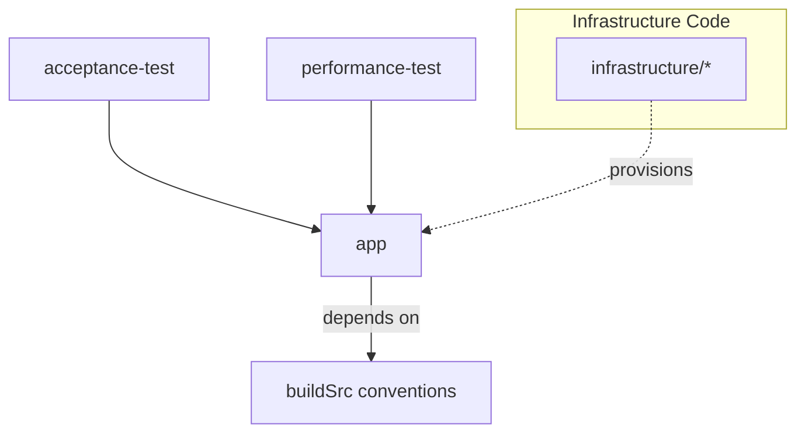
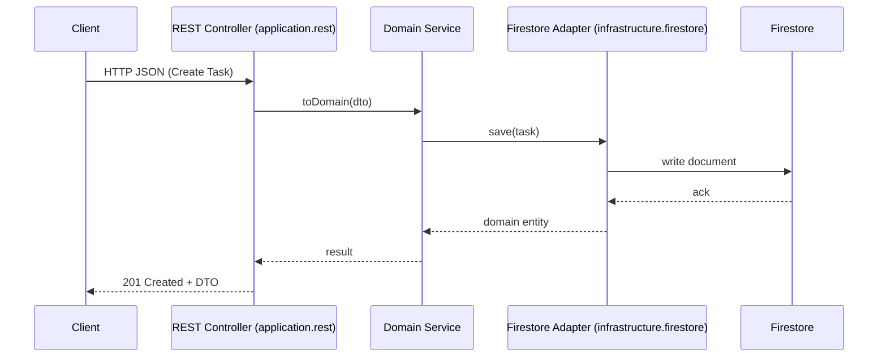
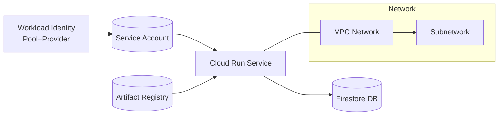

# Task List

[](https://sonarcloud.io/summary/new_code?id=earelin_task-list)
[](https://sonarcloud.io/summary/new_code?id=earelin_task-list)

Spring Boot (Java 21) multi‑module prototype managing task lists with Firestore persistence, MapStruct DTO mapping, and comprehensive test suites (unit, integration, acceptance, performance).

## Architecture Overview

### Module Relationships


### Runtime Request Flow


### Infrastructure (GCP)


### CI/CD Pipeline (Simplified)
```mermaid
flowchart LR
  P[Push trunk] --> B[Build & Unit Tests]
  B --> IT[Integration Tests]
  IT --> Scan[Security & Lint (Snyk/Checkov)]
  Scan --> Sonar[Sonar Analysis]
  Sonar --> Auth[OIDC Auth to GCP]
  Auth --> Img[Build & Push Image]
  Img --> Done[Publish / Deploy (future)]
```

## Modules

- `app/` – Main Spring Boot application
- `acceptance-test/` – Cucumber BDD tests
- `performance-test/` – Gatling load tests
- `infrastructure/` – Terraform (local Kubernetes + GCP environments)

## Quick Start (Local Dev)

```bash
# Build everything
./gradlew build

# Run the application (ensure Firestore emulator up via docker compose)
./gradlew :app:bootRun

# Alternatively start dependencies & app via compose profile
docker compose --profile run-app up --build
```

The API will be available on <http://localhost:8080> (see actuator at `/actuator/health`).

## Firestore Emulator

A Firestore emulator runs locally (port 8100) via Docker Compose or Kubernetes (Terraform under `infrastructure/local/`). The Spring profile auto-detects the emulator if `SPRING_CLOUD_GCP_FIRESTORE_EMULATOR_ENABLED=true`.

## Testing

```bash
# Unit tests
./gradlew test
# Integration tests
./gradlew :app:integrationTest
# Acceptance (Cucumber)
./gradlew cucumber
# Performance (Gatling)
./gradlew gatlingRun
```

Coverage is aggregated via Jacoco; reports under `app/build/reports`.

## Code Quality & Security

```bash
./gradlew check              # All checks
./gradlew checkstyleMain spotbugsMain
make lint-terraform          # Terraform lint
make fix-lint-terraform      # Auto-format TF
```

Snyk and Checkov run in CI (see `.github/workflows`). SonarCloud analyzes quality & coverage.

## Building & Publishing Container Image

CI publishes an image to Google Artifact Registry using Workload Identity Federation after successful build & tests. Manual local build:

```bash
./gradlew :app:build
docker build -t task-list-app:local -f app/Dockerfile app
```

(Only `app/build/libs/*.jar` is sent in build context via `.dockerignore`).

## Terraform Infrastructure

Structure:

- `infrastructure/local/` – Local Kubernetes (Firestore emulator deployment & service)
- `infrastructure/gcloud/components/` – Reusable modules (`network`, `app`, `firestore`, `github_actions`)
- `infrastructure/gcloud/environments/{dev,shared}` – Environment compositions

Typical workflow (dev env):

```bash
cd infrastructure/gcloud/environments/dev
terraform init
terraform plan
terraform apply
```

Shared environment owns Workload Identity Federation (WIF) pool/provider; dev references only its own resources.

### Workload Identity Federation

Module `github_actions` provisions:

- Service Account (GH Actions)
- Workload Identity Pool & Provider (GitHub OIDC)
- IAM binding restricted to repository + `trunk` branch

Outputs (see `dev/outputs.tf` & shared env):

- `github_actions_service_account_email`
- `github_actions_workload_identity_provider`

Set these as repo secrets:

```text
GCP_SERVICE_ACCOUNT_EMAIL=<output value>
GCP_WORKLOAD_IDENTITY_PROVIDER=<output value>
```

## CI/CD Pipeline Highlights

- Branch: `trunk` triggers full pipeline
- Conditional lint steps (Dockerfile / pipelines / Terraform) based on changed files
- SonarQube, Snyk, Checkov security scans
- Image build & push (Artifact Registry) using OIDC federation (no long‑lived keys)

## Domain & Mapping

Domain logic kept free of Spring annotations under `app/src/main/java/.../domain`. REST layer maps via MapStruct interfaces under `application.rest`. Firestore adapters live under `infrastructure.firestore` with translation between domain and persistence models.

## Observability

- Metrics via Micrometer / Prometheus (scrape config in `config/docker-compose/prometheus.yml`)
- Traces exported via OpenTelemetry to Jaeger when observability compose profile is active.

## Common Developer Tasks

| Task | Command |
|------|---------|
| Run app with dependencies | `docker compose --profile run-app up` |
| Hot reload (code changes) | `./gradlew :app:bootRun` |
| Add new endpoint | Add controller + DTO + mapper, update domain if needed, write tests |
| Add Firestore entity | Create domain model + repository adapter + mapper |
| Run only integration tests | `./gradlew :app:integrationTest` |

## Troubleshooting

- Firestore emulator not reachable: ensure port 8100 exposed (see `infrastructure/local/firestore/main.tf`).
- 409 on WIF pool creation: resource already exists; import or ensure only shared env manages it.
- WIF provider 400 attribute condition error: ensure `attribute_condition` present and IAM binding depends on provider.

## Roadmap (Potential Enhancements)

- Add OpenAPI spec (springdoc-openapi)
- Add rate limiting & caching policies
- Expand Network Policies for local k8s
- Remote Gradle build cache

## License

MIT
